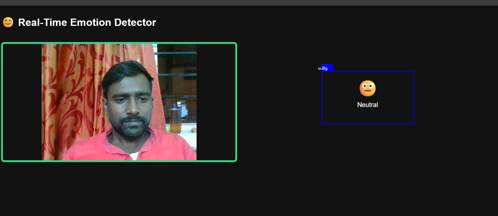

# Emotion-Detector
A Real-Time Facial Emotion Detector web app built using JavaScript and face-api.js. It detects and displays emotions like happy, sad, angry, and more using your webcam.

# 😊 Real-Time Emotion Detector

A web app that uses face-api.js to detect human emotions in real-time through your webcam.

## 🚀 Features

- Real-time face detection
- Emotion classification (happy, sad, angry, surprised, etc.)
- Built using face-api.js and JavaScript

## 📸 Demo



## **Live Demo:**  
[Click to try it now!](https://ravisksingh1999.github.io/Emotion-Detector/)

## 🛠️ Tech Stack

- HTML, CSS, JavaScript
- [face-api.js](https://github.com/justadudewhohacks/face-api.js)

## 🔧 How to Run

1. Clone this repo:
   ```bash
   git clone https://github.com/your-username/Emotion-Detector.git
Open index.html in your browser.

Allow webcam access.

📝 Note
Make sure you have a stable internet connection to load face-api.js models.

This project runs completely in-browser, no backend required.

📄 License
This project is for learning purposes.

---

Let me know if you want to add anything else like deployment link or credits!
